  

<h3 align="center"><a href="https://abdul-haris-rosa-portfolio.elharyz09.chatgpt.site">✦ BUKA PORTOFOLIO INTERAKTIF 3D ↗</a></h3>

Jelajahi versi lengkap dengan visual 3D, liquid glass, dan animasi interaktif.

<a href="https://github.com/abdulharisr/abdulharisr/tree/main/docs">Lihat kode portofolio di GitHub ↗</a>

  <strong><a href="#01--tentang-saya">TENTANG</a> &nbsp; · &nbsp;
  <a href="#02--fokus-pengembangan">FOKUS</a> &nbsp; · &nbsp;
  <a href="#03--toolbox">TOOLBOX</a> &nbsp; · &nbsp;
  <a href="#04--perjalanan">PERJALANAN</a> &nbsp; · &nbsp;
  <a href="#05--mari-terhubung">KONTAK ↗</a></strong>

  Mahasiswa Informatika &nbsp; / &nbsp; Pengajar &amp; Teknisi TKJ &nbsp; / &nbsp; Technology enthusiast

## 01 / Tentang saya

### Teknologi yang dekat dengan kebutuhan nyata.

Saya **Abdul Haris Rosa**, mahasiswa **Teknik Informatika di Universitas Muhadi Setiabudi** dan **tenaga pengajar serta teknisi (Toolman) TKJ di SMK Bhakti Praja Talang**.

Saya tertarik pada cara perangkat lunak, jaringan komputer, dan pendidikan dapat saling mendukung. Melalui pembelajaran dan eksplorasi, saya ingin membangun solusi digital yang jelas kegunaannya, terstruktur, dan mudah dipahami.

**Yang sedang saya dalami:** pengembangan web, infrastruktur jaringan, dan sistem pendukung keputusan untuk lingkungan pendidikan.

  

## 02 / Fokus pengembangan

### Sistem pendukung keputusan akademik
**Fokus akademik · Simple Additive Weighting**

Eksplorasi penerapan metode **SAW** untuk evaluasi kelayakan kenaikan kelas siswa. Fokusnya mencakup pengolahan kriteria, pembobotan, dan pemeringkatan hasil evaluasi.

`PHP` `MySQL` `Bootstrap` `SAW`

<strong>Pelajari arah pengembangannya →</strong>

- **Konteks:** kebutuhan evaluasi akademik di lingkungan sekolah.
- **Pendekatan:** mempelajari pembobotan dan pengolahan beberapa kriteria menggunakan SAW.
- **Tujuan:** mendukung proses penilaian yang lebih terstruktur dan mudah ditelusuri.

Bagian ini menjelaskan fokus akademik, bukan klaim bahwa aplikasi sudah dirilis. Tautan kode atau demo dapat ditambahkan ketika tersedia untuk publik.

### Infrastruktur jaringan & pembelajaran TKJ
**Eksplorasi teknis · Teknologi pendidikan**

Mendalami jaringan komputer dan sistem operasi yang berkaitan dengan kegiatan pembelajaran serta kebutuhan teknis sekolah.

`MikroTik` `Linux` `Networking` `TKJ`

<strong>Pelajari bidang eksplorasinya →</strong>

- Jaringan komputer dan infrastruktur pendukung pembelajaran.
- Eksplorasi sistem operasi Linux dan teknologi MikroTik.
- Hubungan antara praktik teknis, pengajaran, dan kebutuhan di lapangan.

### Repository publik

| Repository | Tentang |
| :--- | :--- |
| **[Aplikasi-Login-1 ↗](https://github.com/abdulharisr/Aplikasi-Login-1)** | Eksplorasi aplikasi login. Dokumentasi publik masih minimal. |
| **[Profile Portfolio ↗](https://github.com/abdulharisr/abdulharisr)** | README ini beserta aset SVG animasi yang disimpan di repository. |

**[Jelajahi semua repository →](https://github.com/abdulharisr?tab=repositories)**

## 03 / Toolbox

Teknologi yang saya pelajari dan eksplorasi, dikelompokkan menurut penggunaannya.

**Web development**  
`PHP` &nbsp; `JavaScript` &nbsp; `HTML` &nbsp; `CSS` &nbsp; `Bootstrap`

**Data & decision support**  
`MySQL` &nbsp; `Simple Additive Weighting`

**Networks & systems**  
`Linux` &nbsp; `MikroTik` &nbsp; `Jaringan komputer`

**Development workflow**  
`Git` &nbsp; `GitHub` &nbsp; `Visual Studio Code`

## 04 / Perjalanan

**2024 — sekarang · Pendidikan & teknologi**  
### Tenaga Pengajar & Teknisi (Toolman) TKJ
SMK Bhakti Praja Talang

---

**2024 · Pelayanan publik**  
### Ketua KPPS & Pantarlih
Komisi Pemilihan Umum (KPU)

---

**2022 — 2023 · Pendataan**  
### Petugas Pendata Lapangan (PPL)
Badan Pusat Statistik (BPS)

<strong>Di luar pekerjaan: organisasi & minat personal →</strong>

**Organisasi**

- Wakil Ketua Organisasi Kesenian.
- Sekretaris Karang Taruna.
- Anggota Paskibraka.

**Sisi personal**

Selain mengeksplorasi teknologi, saya menikmati touring dan bermain game.

## 05 / Mari terhubung

  

  <strong>
    <a href="mailto:elharyz09@gmail.com">KIRIM EMAIL ↗</a> &nbsp; / &nbsp;
    <a href="https://www.linkedin.com/in/abdul-haris-r">LINKEDIN ↗</a> &nbsp; / &nbsp;
    <a href="https://t.me/ryzz13">TELEGRAM ↗</a>
  </strong>

Terima kasih sudah mampir. Mari belajar, membangun, dan berbagi.

  <strong>AR.</strong> &nbsp; Abdul Haris Rosa &nbsp; · &nbsp; Build with purpose.

